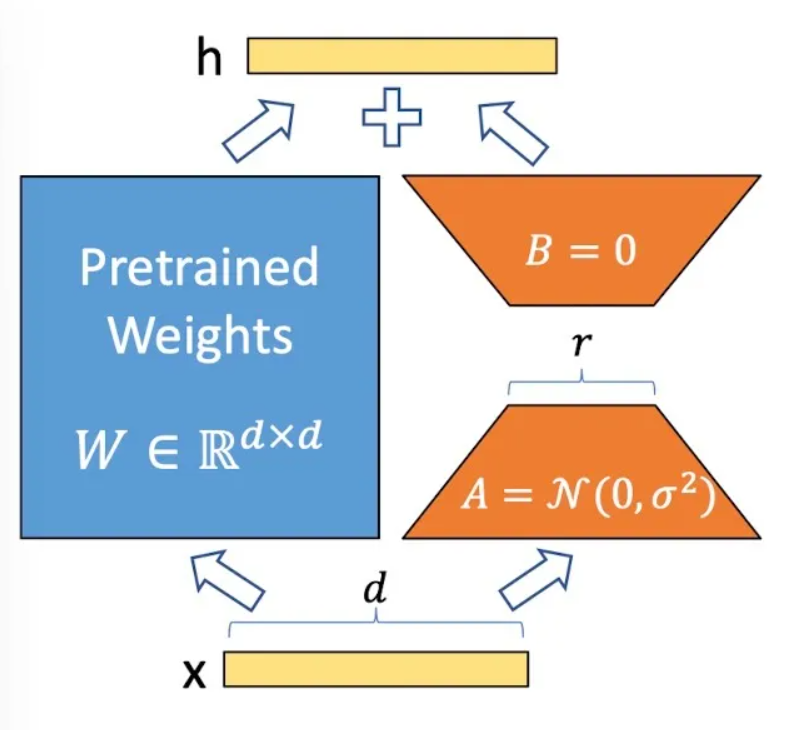
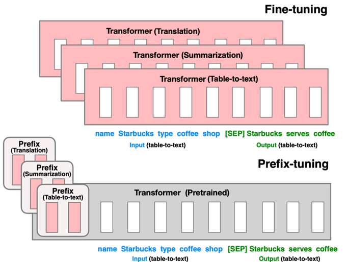
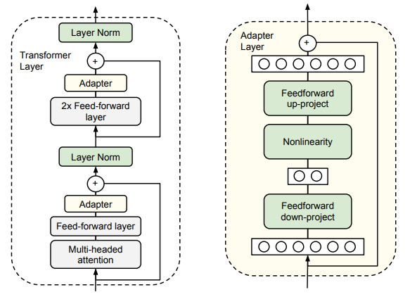
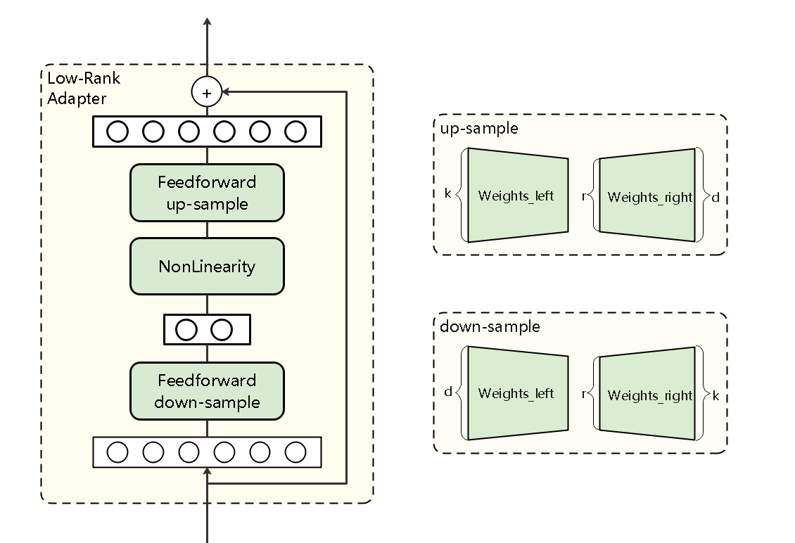
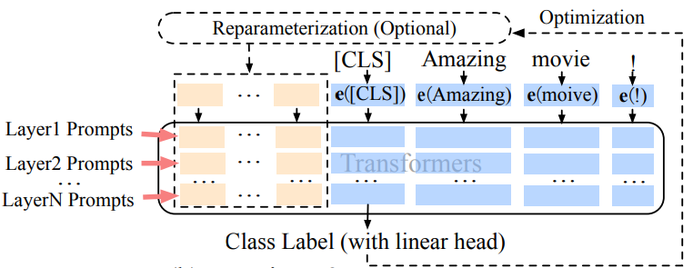

# MindPet - delta 轻量化微调算法用户文档


## 一、LoRA算法

### 1.1 算法介绍

LoRA算法是一种针对超大语言模型的轻量化微调算法，通过使用两个低维度的矩阵乘积近似原始模型中线性结构的权重矩阵，在下游任务微调时，冻结原始网络参数，仅更新LoRA矩阵，来减少微调参数数量。实验结果表明，添加了LoRA结构的Transformer模型，在仅更新少数参数的情况下，微调后精度近似全参微调。

算法原理如下图所示，算法具体细节可参考相关论文[LoRA: Low-Rank Adaptation of Large Language Models](https://arxiv.org/abs/2106.09685)。

<center>        <br>    <div style="color:orange; border-bottom: 1px solid #d9d9d9;    display: inline-block;    color: #999;    padding: 2px; ">LoRA算法原理图: 在原Dense层增加一个旁支，包含两个低维度的矩阵A与矩阵B，训练时只需更新这两个矩阵的参数。</div> </center>


### 1.2 API接口

#### LoRADense

```python
class mindpet.delta.lora.LoRADense(in_channels, 
                              out_channels, 
                              lora_rank, 
                              lora_alpha,
                              lora_dropout,
                              lora_a_init=HeUniform(negative_slope=math.sqrt(5)),
                              lora_b_init='zero',
                              param_init_type=mindspore.dtype.float32,
                              compute_dtype=mindspore.dtype.float16,
                              weight_init='normal',
                              bias_init='zeros',
                              has_bias=True,
                              activation=None)
```

添加LoRA结构的全连接层。公式如下：
$$
outputs = activation(X∗weight^{T}+bias+\frac{lora\_alpha}{lora\_rank}\cdot X_{lora\_dropout}∗lora\_a^{T}∗lora\_b^{T})
$$

其中 `X` 是输入`Tensor`；`activation` 是激活函数； `weight` 是一个权重矩阵，其数据类型与 `X` 相同，`shape`为`(out_channels, in_channels)`；`bias` 是一个偏置向量，其数据类型与 `X` 相同（仅当`has_bias`为`True`时）；`lora_alpha`为常数超参，作用类似于学习率；`lora_rank`对应低维矩阵的行(列)数；`lora_dropout`为丢弃率；`lora_a`，`lora_b`为LoRA算法的低维矩阵，`shape`分别为`(lora_rank, in_channels)`， `(out_channels, lora_rank)`。


**参数**

- **in_channels**(int) - 原Dense层输入`Tensor`的空间维度。
- **out_channels**(int）- 原Dense层输出`Tensor`的空间维度。
- **lora_rank**(int) - LoRA算法中`lora_a`矩阵的行数，`lora_b`矩阵的列数。
- **lora_alpha**(Union[int, float]) - 常数超参，不为0。
- **lora_dropout**(float) - 丢弃率，取值范围[0.0,1.0)。
- **lora_a_init**(Union[Tensor, str, Initializer, numbers.Number]) - `lora_a`矩阵的初始化方法。数据类型与 x 相同。str的值引用自函数 `initializer`，默认值：`HeUniform(negative_slope=math.sqrt(5))`。
- **lora_b_init**(Union[Tensor, str, Initializer, numbers.Number]) - `lora_b`矩阵的初始化方法。数据类型与 x 相同。str的值引用自函数 `initializer`，默认值：`'zeros'`。
- **param_init_type**(dtype) - 参数初始化精度， `mindspore.dtype.float16`或`mindspore.dtype.float32`。
- **compute_dtype**(dtype) - 计算时使用的精度，`mindspore.dtype.float16`或`mindspore.dtype.float32`。
- **weight_init** (Union[Tensor, str, Initializer, numbers.Number]) - 权重参数的初始化方法。数据类型与 x 相同。str的值引用自函数 initializer。默认值：`'normal'`。
- **bias_init** (Union[Tensor, str, Initializer, numbers.Number]) - 偏置参数的初始化方法。数据类型与 x 相同。str的值引用自函数 initializer。默认值：`'zeros'`。
- **has_bias** (bool) - 是否使用偏置向量 bias 。默认值：True。
- **activation** (Union[str, Cell, Primitive, None]) - 应用于全连接层输出的激活函数。可指定激活函数名，如`'relu'`，或具体激活函数，如`mindspore.nn.ReLU()`。默认值：None。


**输入**

shape为 `(∗, in_channels)` 的Tensor。参数中的 `in_channels` 应等于输入中的 `in_channels` 。


**输出**

shape为 `(∗, out_channels)` 的Tensor 。


**异常**

- **TypeError** - `in_channels`，`out_channels`或`lora_rank`不是整数。
- **TypeError** - `lora_alpha`不为int或float类型。
- **TypeError** - `has_bias`不是bool值。
- **TypeError** - `lora_dropout`不为float类型数据。
- **TypeError** - `activation` 不是`str`、`Cell`、`Primitive`或者`None`。
- **TypeError** - `param_init_type`，`compute_dtype`不为`mindspore.dtype.float16`或`mindspore.dtype.float32`。
- **ValueError** - `in_channel` ，`out_channel`，`lora_rank`为0或负数。
- **ValueError** -`lora_aplha`为0。
- **ValueError** - `lora_dropout`范围不为[0,1)。
- **ValueError** - `lora_a_init`为Tensor时，shape长度不等于2，或shape[0]不等于`lora_rank`，或shape[1]不等于`in_channels`。
- **ValueError** - `lora_b_init`为Tensor时，shape长度不等于2，或shape[0]不等于`out_channels`，或shape[1]不等于`lora_rank`。
- **ValueError** - `weight_init`为Tensor时，shape长度不等于2，或shape[0]不等于`out_channels`，或shape[1]不等于`in_channels`。


##### shard

```python
shard(strategy_org_dense_matmul=None,
      strategy_org_bias_add=None,
      strategy_lora_dropout=None,
      strategy_lora_a_matmul=None,
      strategy_lora_b_matmul=None,
      strategy_lora_mul=None,
      strategy_lora_add=None,
      strategy_activation=None)
```

指定LoRADense中算子的分布式策略。仅在半自动并行模式或自动并行模式下生效。

在PyNative模式下，可以利用此方法指定某个Cell以图模式进行分布式执行。 所有参数均为元组类型， 其中的每一个元素指定对应的输入/输出的Tensor分布式策略，可参考： mindspore.ops.Primitive.**shard** 的描述。也可以设置为None，会默认以数据并行执行。 其余算子的并行策略由输入输出指定的策略推导得到。


**参数**

- **strategy_org_dense_matmul**(tuple) - 原始dense层matmul算子的分布式策略。默认值：None。注意该matmul算子的transpose_b已设置为True。
- **strategy_org_bias_add**(tuple) - 原始dense层bias_add算子的分布式策略。默认值：None。
- **strategy_lora_dropout**(tuple) - LoRADense层dropout算子的分布式策略。默认值：None。
- **strategy_lora_a_matmul**(tuple) - LoRADense层lora_a模块matmul算子的分布式策略。注意该matmul算子的transpose_b已设置为True。默认值：None。
- **strategy_lora_b_matmul**(tuple) - LoRADense层lora_b模块matmul算子的分布式策略。注意该matmul算子的transpose_b已设置为True。默认值：None。
- **strategy_lora_mul**(tuple) - LoRADense层mul算子的分布式策略。默认值：None。
- **strategy_lora_add**(tuple) - LoRADense层add算子的分布式策略。默认值：None。
- **strategy_activation**(tuple) - LoRADense层激活函数的分布式策略。默认值：None。


**异常**

- **ValueError** - 半自动并行模式或自动并行模式下，不支持LogSoftmax激活函数。


### 1.3 使用样例

通过以下步骤将模型结构中的线性层修改为带有LoRA结构的线性层，冻结网络进行训练：

1）安装mindpet工具包。（[安装方法参考《README.md》第二章](../README.md)）

2）在模型的Attention结构中，从工具包引入`LoRADense`类，并将原query、value层的`nn.Dense`替换为`LoRADense`，无需修改原始参数，需新增`lora_rank`与`lora_alpha`两个必选参数，其余参数可参考API接口自行指定。如果进行分布式训练，可调用`shard`方法指定分布式策略。

```python
from mindpet.delta import LoRADense

# original Dense Layer
# dense1 = nn.Dense(in_channels=1*28*28, out_channels=512,...)

# replace Dense Layer with LoRADense
dense1 = LoRADense(in_channels=1*28*28, out_channels=512, lora_rank=8, lora_alpha=16...)
# if distributed training is required, invoke shard method
dense1.shard(strategy_org_dense_matmul=((2, 1), (4, 1)),
             strategy_org_bias_add=((2, 4), (4,)),
             strategy_lora_dropout=((2, 1),),
             strategy_lora_a_matmul=((2, 1), (1, 1)),
             strategy_lora_b_matmul=((2, 1), (4, 1)),
             strategy_lora_mul=((2, 4), ()),
             strategy_lora_add=((2, 4), (2, 4)),
             strategy_activation=((2, 4), (2, 4))
```

3）在训练脚本中，从工具包中引入`freeze_delta`方法，定义优化器之前调用`freeze_delta`冻结除`LoRA`矩阵外其它原模型权重。注意，为了适配下游任务引入的额外模型结构无需冻结，可以用`exclude`参数指定无需冻结的结构名称。（[冻结方法参考《MindPet_GraphOperation_README.md》第一章](MindPet_GraphOperation_README.md)）

```Python
from mindpet.graph import freeze_delta

# freeze all cells except LoRA and head
freeze_delta(model=network, mode='lora', exclude=['*head*'])
```

然后从工具包中引入`TrainableParamsCheckPoint`类，将保存ckpt的类改为`TrainableParamsCheckPoint`，仅保存需要更新的参数，可节约存储空间。（[详细方法参考《MindPet_GraphOperation_README.md》第二章](MindPet_GraphOperation_README.md)）

由于微调后只保存了部分参数，推理时具体如何加载ckpt请参考[附录A](###A 分布式微调后模型评估方法)。

```python
from mindpet.graph import TrainableParamsCheckPoint

# original callback
# ckpt_callback = ModelCheckpoint(...)

# replace ModelCheckpoint with TrainableParamsCheckPoint
ckpt_callback = TrainableParamsCheckPoint(...)
```


### 1.4 实验效果

下面实验基于MindSpore/models开源仓中的[Bert-base](https://gitee.com/mindspore/models/tree/master/official/nlp/Bert)复现。

<table class="tg">
<thead>
  <tr>
    <th class="tg-54sw" rowspan="2">模型</th>
    <th class="tg-54sw" rowspan="2">下游任务</th>
    <th class="tg-54sw" rowspan="2">模式</th>
    <th class="tg-54sw" colspan="5">训练参数</th>
    <th class="tg-54sw" rowspan="2">微调参数占比</th>
    <th class="tg-54sw" rowspan="2">静态内存+动态内存</th>
    <th class="tg-54sw" rowspan="2">精度</th>
  </tr>
  <tr>
    <th class="tg-54sw">epoch</th>
    <th class="tg-54sw">优化器</th>
    <th class="tg-54sw">学习率</th>
    <th class="tg-54sw">lora_rank</th>
    <th class="tg-54sw">lora_alpha</th>
  </tr>
</thead>
<tbody>
  <tr>
    <td class="tg-rcip" rowspan="2">bert-base</td>
    <td class="tg-rcip" rowspan="2">t-news</td>
    <td class="tg-rcip">baseline</td>
    <td class="tg-rcip">10</td>
    <td class="tg-rcip">Adam</td>
    <td class="tg-0ys1">1.00E-04</td>
    <td class="tg-rcip">\</td>
    <td class="tg-rcip">\</td>
    <td class="tg-rcip">100%</td>
    <td class="tg-rcip">1360MB+1698MB</td>
    <td class="tg-rcip">0.5729</td>
  </tr>
  <tr>
    <td class="tg-rcip">LoRA</td>
    <td class="tg-rcip">10</td>
    <td class="tg-rcip">Adam</td>
    <td class="tg-0ys1">1.00E-03</td>
    <td class="tg-rcip">8</td>
    <td class="tg-rcip">16</td>
    <td class="tg-rcip">0.30%</td>
    <td class="tg-rcip">456MB+1507MB</td>
    <td class="tg-rcip">0.5625</td>
  </tr>
</tbody>
</table>


## 二、Prefix-Tuning算法

### 2.1 算法介绍

Prefix-Tuning通过在输入序列中加入跟任务相关的向量，只训练这部分任务相关的向量，保持预训练模型的参数不变。Prefix-Tuning会在每个attention的key和value向量中插入l个用于更新参数的prefix向量，然后冻结预训练模型的参数， 只更新这些prefix向量的参数，就可以达到近似全参微调的效果。


算法原理如下图所示，算法具体实现细节可参考论文[Prefix-Tuning: Optimizing Continuous Prompts for Generation](https://aclanthology.org/2021.acl-long.353.pdf)

<center>    <br>    <div style="color:orange; border-bottom: 1px solid #d9d9d9;    display: inline-block;    color: #999;    padding: 2px; ">
Prefix算法原理图: 对于每个下游任务，添加一份和当前任务相关的prefix向量，冻结预训练模型的其他参数，只训练这些prefix向量。
</div> </center>


### 2.2 API接口

``` python
 class mindpet.delta.prefix_layer.PrefixLayer(prefix_token_num, 
                                         batch_size,
                                         num_heads,
                                         hidden_dim,
                                         embed_dim,
                                         mid_dim=512,
                                         dropout_rate=0.1):
```

定义PrefixLayer层（内部包含`past_key`和`past_value`矩阵）


**参数**

- **prefix_token_num**(int) - `prefix`的长度，设置为batch_size的8倍，在昇腾芯片上计算更快。
- **batch_size**(int) - 单次传递给程序用以训练的数据个数，与原模型参数一致。
- **num_heads**(int) - 多头注意力头数，与原模型参数一致。
- **hidden_dim**(int) - 模型隐藏维度，与原模型参数一致。
- **embed_dim**(int) - `embedding`的维度，与原模型参数一致。
- **mid_dim**(int) - `prefix`中间维度，默认值为512。
- **dropout_rate**(float) - 丢弃率，默认值为0.1。


**异常**

- **TypeError** - `prefix_token_num`不是正整数。
- **TypeError** - `batch_size`不是正整数。
- **TypeError** - `num_heads`不是正整数。
- **TypeError** - `hidden_dim`不是正整数。
- **TypeError** - `embed_dim`不是正整数。
- **TypeError** - `mid_dim`不是正整数。
- **ValueError** - `prefix_token_num`不是`batch_size`的整数倍。
- **ValueError** - `dropout_rate`不在[0,1)之内。


### 2.3 使用样例

通过以下步骤将模型结构中`key`、`value`和`attention_mask`修改为新的`key`、`value`和`attention_mask`，冻结网络进行训练：

1）安装mindpet工具包。（[安装方法参考《README.md》第二章](../README.md)）

2）在模型的Attention结构中，从工具包中引入`PrefixLayer`类，创建`prefixlayer`，将`prefixlayer`对象中的`past_key_reparam`、`past_value_reparam`矩阵与原`key`、`value`矩阵进行`concat`操作。然后定义全为1的`help`矩阵，将原`attention_mask`矩阵与`help`矩阵进行`concat`（新的`attention_mask`矩阵shape与新的`query`*`key`矩阵的shape相同）。

```python
import mindspore
import numpy
import mindspore.nn as nn

from mindspore.common.tensor import Tensor
# 第一步 导入PrefixLayer
from mindpet.delta.prefix_layer import PrefixLayer

#模型的Attention层
class MaskSelfAttention(nn.Cell):
    def __init__(self,
                 seq_length=1024 #此处其他参数省略
                 ):
        ...
        ...
        # 第二步 在模型的init函数中定义PrefixLayer对象
        self.prefix = PrefixLayer(prefix_token_num=10,batch_size=2,num_heads=20,hidden_dim=1280,
                                  embed_dim=512, mid_dim=512,dropout_rate=0.1) #具体参数值需要根据模型参数决定
        # 定义prefix矩阵
        self.past_key = self.prefix.past_key_reparam
        self.past_value = self.prefix.past_value_reparam
        # 第三步 定义help矩阵,不同模型，矩阵的shape需要适当修改
        self.help_matrix = Tensor(numpy.ones([self.prefix.batch_size,
                                              self.prefix.num_heads-1,
                                              seq_length, seq_length]))
        self.help = Tensor(numpy.ones([self.prefix.batch_size,
                                       self.prefix.num_heads, seq_length,
                                       self.prefix.prefix_token_num // self.prefix.batch_size]))

    def construct(self, input_tensor, attention_mask):
        ...
        ...
        query = input_tensor[0] # 不同模型Q,K,V矩阵定义可能不同
        key = input_tensor[1]
        value = input_tensor[2]
        # 第二步 将prefix矩阵与原来的key，value矩阵进行concat
        key = mindspore.ops.concat((self.past_key, key), 0)
        value = mindspore.ops.concat((self.past_value, value), 0)
        # 第三步 将attention_mask矩阵与help连接(新的attention_mask矩阵shape与新的query*key矩阵的shape相同)
        attention_mask = mindspore.ops.concat((attention_mask, self.help_matrix), 1)
        attention_mask = mindspore.ops.concat((attention_mask, self.help), -1)
```

3）在训练脚本中，从工具包中引入`freeze_delta`方法，定义优化器之前调用`freeze_delta`冻结除`Prefix`矩阵外其它原模型权重。注意，为了适配下游任务引入的额外模型结构无需冻结，可以用`exclude`参数指定无需冻结的结构名称。（[冻结方法参考《MindPet_GraphOperation_README.md》第一章](MindPet_GraphOperation_README.md)）

```Python
from mindpet.graph.freeze_utils import freeze_delta

# freeze all cell except Prefix and head
freeze_delta(model=network, mode='prefix', exclude=['*head*'])
```

然后从工具包中引入`TrainableParamsCheckPoint`类，将保存ckpt的类改为`TrainableParamsCheckPoint`，仅保存需要更新的参数，可节约存储空间。（[详细方法参考《MindPet_GraphOperation_README.md》第二章](MindPet_GraphOperation_README.md)）

由于微调后只保存了部分参数，推理时具体如何加载ckpt请参考[附录A](###A 分布式微调后模型评估方法)。

```python
from mindpet.graph import TrainableParamsCheckPoint

# original callback
# ckpt_callback = ModelCheckpoint(...)

# replace ModelCheckpoint with TrainableParamsCheckPoint
ckpt_callback = TrainableParamsCheckPoint(...)
```


### 2.4 实验效果

下面实验基于MindSpore/models开源仓中的[**GPT2-large**](https://gitee.com/mindspore/models/tree/master/research/nlp/gpt2)复现。

<table class="tg">
<thead>
  <tr>
    <th class="tg-54sw" rowspan="2">模型</th>
    <th class="tg-54sw" rowspan="2">下游任务</th>
    <th class="tg-54sw" rowspan="2">模式</th>
    <th class="tg-54sw" colspan="4">训练参数</th>
    <th class="tg-54sw" rowspan="2">微调参数占比</th>
    <th class="tg-54sw" rowspan="2">静态内存+动态内存</th>
    <th class="tg-54sw" rowspan="2">ppl</th>
  </tr>
  <tr>
    <th class="tg-54sw">epoch</th>
    <th class="tg-54sw">优化器</th>
    <th class="tg-54sw">学习率</th>
    <th class="tg-54sw">prefix_token_num</th>
  </tr>
</thead>
<tbody>
  <tr>
    <td class="tg-rcip" rowspan="2">gpt2-large</td>
    <td class="tg-rcip" rowspan="2">language modeling</td>
    <td class="tg-rcip">baseline</td>
    <td class="tg-rcip">5</td>
    <td class="tg-rcip">Adamw</td>
    <td class="tg-0ys1">1.00E-04</td>
    <td class="tg-rcip">\</td>
    <td class="tg-rcip">100%</td>
    <td class="tg-rcip">11024MB+17303MB</td>
    <td class="tg-rcip">1.2</td>
  </tr>
  <tr>
    <td class="tg-rcip">prefix</td>
    <td class="tg-rcip">5</td>
    <td class="tg-rcip">Adamw</td>
    <td class="tg-0ys1">5.00E-03</td>
    <td class="tg-rcip">10</td>
    <td class="tg-rcip">4.35%</td>
    <td class="tg-rcip">4208MB+16163MB</td>
    <td class="tg-rcip">1.25</td>
  </tr>
</tbody>
</table>


## 三、Adapter算法

### 3.1 算法介绍

Adapter结构本质是一个bottleneck层，包含降维全连接层（adapter_down_proj）、激活层（adapter_non_linear）、升维全连接层（adapter_up_proj）、以及残差连接。具体来说，对每个Transformer Layer，在多头注意力模块后的Feed-forward Layer以及两个Feed-forward Layer的后面，添加Adapter结构。然后冻结预训练模型的参数， 只更新Adapter结构参数。

实验结果表明，添加了Adapter结构的Transformer模型，在仅训练少数参数情况下，微调后精度近似全参微调。

算法原理如下图所示，算法具体细节可参考相关论文[Parameter-Efficient Transfer Learning for NLP](https://arxiv.org/pdf/1902.00751.pdf)。

<center>        <br>    <div style="color:orange; border-bottom: 1px solid #d9d9d9;    display: inline-block;    color: #999;    padding: 2px; ">Adapter结构算法原理图：在Feed-forward Layer后接一个Adapter结构，该结构包含降维全连接层、激活层、升维全连接层以及残差连接。</div> </center>


### 3.2 API接口

#### AdapterDense

```python
class mindpet.delta.adapter.AdapterDense(in_channels, 
                                    out_channels, 
                                    weight_init='normal',
                                    bias_init='zeros',
                                    has_bias=True,
                                    activation=None,
                                    bottleneck_size=64,
                                    non_linearity='gelu',
                                    param_init_type=mindspore.dtype.float32,
                                    compute_dtype=mindspore.dtype.float16)
```

AdapterDense计算的公式如下：
$$
hidden=activation(input*weight+bias)
$$

$$
output=AdapterLayer(hidden)
$$

其中`input`是输入`Tensor`；`hidden`是原生线性层的输出，也是Adapter结构的输入；AdapterLayer结构内部计算逻辑详见AdapterLayer接口说明。


**参数**

* **in_channels** (int) - AdapterDense层输入`Tensor`的空间维度。
* **out_channels** (int) - AdapterDense层输出`Tensor`的空间维度。
* **weight_init** (Union[Tensor, str, Initializer, numbers.Number]) - AdapterDense全连接层权重参数的初始化方法，数据类型与输入`Tensor`相同。`str`的值引用自函数 `initializer`。默认值：`'normal'`。
* **bias_init** (Union[Tensor, str, Initializer, numbers.Number]) - AdapterDense全连接层偏置参数的初始化方法，数据类型与输入`Tensor`相同。`str`的值引用自函数 `initializer`。默认值：`'zeros'`。
* **has_bias** (bool) - 是否使用偏置向量 bias。默认值：`True`。
* **activation** (Union[str, Cell, Primitive, None]) - 应用于全连接层输出的激活函数。可指定激活函数名，如’relu’，或具体激活函数，如`mindspore.nn.ReLU()`。默认值：`None`。
* **bottleneck_size** (int) - AdapterDense中Adapter模块向下投影的维度。默认值：`64`。
* **non_linearity** (str) - AdapterDense中Adapter模块投影后所使用的激活函数。str的值引用自 `get_activation` 方法所支持的激活函数类型。默认值：`'gelu'`。
* **param_init_type** (dtype.Number) - 表示模块的参数初始化类型。默认值：`mindspore.dtype.float32`。其值应为`mindspore.dtype.float32`或`mindspore.dtype.float16`。
* **compute_dtype** (dtype.Number) - 表示dense中矩阵乘法的计算类型。默认值：`mindspore.dtype.float16`。其值应为`mindspore.dtype.float32`或`mindspore.dtype.float16`。


**输入**

shape为 `(∗, in_channels)` 的Tensor。参数中的 `in_channels` 应等于输入中的 `in_channels` 。


**输出**

shape为 `(∗, out_channels)` 的Tensor 。


**异常**

* **TypeError** - `in_channels`，`out_channels`或`bottleneck_size`不是正整数。
* **TypeError** - `has_bias`不是bool值。
* **TypeError** - `activation`不是`str`、`Cell`、`Primitive`。
* **TypeError** - `param_init_type`，`compute_dtype`不为`dtype`类型数据。
* **TypeError** - non_linearity不是str类型。
* **TypeError** - `weight_init`，`bias_init`不是`Tensor`, `str`, `Initializer`, `numbers.Number`。
* **ValueError** - `weight_init`，`bias_init`不属于提供的`initializer`函数提供的初始化方法。
* **ValueError** - `weight_init`的shape长度不等于2，`weight_init`的shape[0]不等于`out_channels`，或者`weight_init`的shape[1]不等于`in_channels`。
* **ValueError** - `bias_init`的shape长度不等于1或`bias_init`的shape[0]不等于`out_channels`。
* **ValueError** - `in_channel`，`out_channel`，`bottleneck_size`为0或负数。
* **ValueError** - non_linearity是str类型，但不是`get_activation` 方法所支持的激活函数列表。
* **KeyError** - `activation`不属于`get_activation`方法所支持的激活函数类型。


##### shard

```python
shard(strategy_matmul_org=None,
      strategy_bias_org=None,
      strategy_activation_org=None,
      strategy_matmul_down_sampler=None,
      strategy_bias_down_sampler=None,
      strategy_non_linearity=None,
      strategy_matmul_up_sampler=None,
      strategy_bias_up_sampler=None,
      strategy_residual_add=None)
```

指定AdapterDense中算子的分布式策略。仅在半自动并行模式或自动并行模式下生效。

在PyNative模式下，可以利用此方法指定某个Cell以图模式进行分布式执行。 所有参数均为元组类型，其中的每一个元素指定对应的输入/输出的Tensor分布式策略，可参考： mindspore.ops.Primitive.**shard** 的描述。也可以设置为None，会默认以数据并行执行。 其余算子的并行策略由输入输出指定的策略推导得到。


**参数**

- **strategy_matmul_org**(tuple) - AdapterDense中原dense层的`matmul`算子的分布式策略。该`matmul`算子的`transpose_b`已设置为True。默认值为None。
- **strategy_bias_org**(tuple) - AdapterDense中原dense层的`bias_add`算子的分布式策略。默认值为None。
- **strategy_activation_org**(tuple) - AdapterDense中原dense层的非线性`activation`算子的分布式策略。默认值为None。
- **strategy_matmul_down_sampler**(tuple) - AdapterDense中AdapterLayer模块的down_sampler模块`matmul`算子的分布式策略。该`matmul`算子的`transpose_b`已设置为True。默认值为None。
- **strategy_bias_down_sampler**(tuple) - AdapterDense中AdapterLayer模块的down_sampler模块`bias_add`算子的分布式策略。默认值为None。
- **strategy_non_linearity**(tuple) - AdapterDense中AdapterLayer模块的`non_linearity`算子的分布式策略。默认值为None。
- **strategy_matmul_up_sampler**(tuple) - AdapterDense中AdapterLayer模块的up_sampler模块`matmul`算子的分布式策略。该`matmul`算子的`transpose_b`已设置为True。默认值为None。
- **strategy_bias_up_sampler**(tuple) - AdapterDense中AdapterLayer模块的up_sampler模块`bias_add`算子的分布式策略。默认值为None。
- **strategy_residual_add**(tuple) - AdapterDense中AdapterLayer模块的`residual_add`算子的分布式策略。默认值为None。


**异常**

- **ValueError** - 半自动并行模式或自动并行模式下，不支持LogSoftmax激活函数。


#### AdapterLayer

```python
class mindpet.delta.adapter.AdapterLayer(hidden_size: int,
                                    bottleneck_size: int = 64,
                                    non_linearity: str = "gelu",
                                    param_init_type: mindspore.dtype.float32,
                                    compute_dtype: mindspore.dtype.float16)
```
AdapterLayer计算的公式如下：
$$
output=input + (non\_linearity(input * W_{down\_sample} + bias_{down\_sample})) * W_{up\_sample} + bias_{up\_sample}
$$

其中`input`是输入`Tensor`；是AdapterLayer结构的输入；`non_linearity`是激活函数。$W_{down\_sample}$是降维线性层的权重矩阵，$W_{up\_sample}$是升维全线性层的权重矩阵。$bias_{down\_sample}$是降维线性层的偏置项，$bias_{up\_sample}$是升维线性层的偏置项。


**参数**

* **hidden_size** (int): 隐藏层输出的特征向量维度，亦是AdapterLayer模块输入的特征向量维度。
* **bottleneck_size** (int): AdapterLayer中Adapter模块向下投影的维度。默认值：64。
* **non_linearity** (str) - Adapter结构中向下投影后所使用的激活函数。
        str的值引用自mindspore中 `get_activation` 方法所支持的激活函数类型。
        默认为 'gelu'。
* **param_init_type** (dtype.Number): 表示Adapter结构的参数初始化类型。
        其值应为mindspore.dtype.float32或mindspore.dtype.float16。
        默认值：mindspore.dtype.float32。
* **compute_dtype** (dtype.Number): 表示Adapter结构的矩阵乘法的计算类型。
        其值应为mindspore.dtype.float32或mindspore.dtype.float16。
        默认值：mindspore.dtype.float16。


**输入**

* shape为 `(∗, in_channels)` 的Tensor。参数中的 `in_channels` 应等于输入中的 `hidden_size` 。


**输出**

* shape为 `(∗, out_channels)` 的Tensor 。参数中的 `out_channels` 应等于输入中的 `hidden_size` 。


**异常**

* **TypeError** - hidden_size，bottleneck_size不是int类型数据。
* **TypeError** - bottleneck_size不为int类型数据。
* **TypeError** - non_linearity不是str类型。
* **TypeError** - param_init_type，compute_dtype不为dtype类型数据;或是为dtype类型，但不在[mindspore.dtype.float32, mindspore.dtype.float16]范围内。
* **ValueError** - hidden_size，bottleneck_size为0或负数。
* **ValueError** - non_linearity是str类型，但不是`get_activation` 方法所支持的激活函数列表。


##### shard

```python
shard(strategy_matmul_down_sampler=None,
      strategy_bias_down_sampler=None,
      strategy_non_linearity=None,
      strategy_matmul_up_sampler=None,
      strategy_bias_up_sampler=None,
      strategy_residual_add=None)
```

指定AdapterLayer中算子的分布式策略。仅在半自动并行模式或自动并行模式下生效。

在PyNative模式下，可以利用此方法指定某个Cell以图模式进行分布式执行。 所有参数均为元组类型， 其中的每一个元素指定对应的输入/输出的Tensor分布式策略，可参考： mindspore.ops.Primitive.**shard** 的描述。也可以设置为None，会默认以数据并行执行。 其余算子的并行策略由输入输出指定的策略推导得到。


**参数**

- **strategy_matmul_down_sampler**(tuple) - AdapterLayer中down_sampler模块`matmul`算子的分布式策略。该`matmul`算子的`transpose_b`已设置为True。默认值为None。
- **strategy_bias_down_sampler**(tuple) - AdapterLayer中down_sampler模块`bias_add`算子的分布式策略。默认值为None。
- **strategy_non_linearity**(tuple) - AdapterLayer中`non_linearity`算子的分布式策略。默认值为None。
- **strategy_matmul_up_sampler**(tuple) - AdapterLayer中up_sampler模块`matmul`算子的分布式策略。该`matmul`算子的`transpose_b`已设置为True。默认值为None。
- **strategy_bias_up_sampler**(tuple) - AdapterLayer中up_sampler模块`bias_add`算子的分布式策略。默认值为None。
- **strategy_residual_add**(tuple) - AdapterLayer中`residual_add`算子的分布式策略。默认值为None。


**异常**

- **ValueError** - 半自动并行模式或自动并行模式下，不支持LogSoftmax激活函数。


### 3.3 使用样例

#### AdapterDense

通过以下步骤将模型结构中的线性层修改为带有Adapter结构的线性层：

1）安装mindpet工具包。（[安装方法参考《README.md》第二章](../README.md)）

2）在模型的Attention结构中，从工具包中引入`AdapterDense`类，并参照算法原理将原有`nn.Dense`类替换为`AdapterDense`，无需修改原始参数，需新增`bottleneck_size`必选参数，其余参数可参考API接口自行指定。如果进行分布式训练，则调用`shard`方法指定分布式策略。

```python
from mindpet.delta import AdapterDense

# original Dense Layer
# dense1 = nn.Dense(in_channels=1*28*28, out_channels=512,...)

# replace Dense Layer with AdapterDense
dense1 = AdapterDense(in_channels=1*28*28, out_channels=512, bottleneck_size=64...)

# if distributed training is required, invoke shard method
dense1.shard(strategy_matmul_org=((2, 4), (1, 4)),
             strategy_bias_org=((2, 1), (1,)),
             strategy_activation_org=((2, 1),),
             strategy_matmul_down_sampler=((2, 1), (1, 1)),
             strategy_bias_down_sampler=((2, 1), (1,)),
             strategy_non_linearity=((2, 1),),
             strategy_matmul_up_sampler=((2, 1), (1, 1)),
             strategy_bias_up_sampler=((2, 1), (1,)),
             strategy_residential_add=((2, 1), (2, 1)))
```

3）在训练脚本中，从工具包中引入`freeze_delta`方法，定义优化器之前调用`freeze_delta`冻结除`Adapter`矩阵外其它原模型权重。注意，为了适配下游任务引入的额外模型结构无需冻结，可以用`exclude`参数指定无需冻结的结构名称。（[冻结方法参考《MindPet_GraphOperation_README.md》第一章](MindPet_GraphOperation_README.md)）

```Python
from mindpet.graph.freeze_utils import freeze_delta

# freeze all cell except Adapter and head
freeze_delta(model=network, mode='adapter', exclude=['*head*'])
```

然后从工具包中引入`TrainableParamsCheckPoint`类，将保存ckpt的类改为`TrainableParamsCheckPoint`，仅保存需要更新的参数，可节约存储空间。（[详细方法参考《MindPet_GraphOperation_README.md》第二章](MindPet_GraphOperation_README.md)）

由于微调后只保存了部分参数，推理时具体如何加载ckpt请参考[附录A](###A 分布式微调后模型评估方法)。

```python
from mindpet.graph import TrainableParamsCheckPoint

# original callback
# ckpt_callback = ModelCheckpoint(...)

# replace ModelCheckpoint with TrainableParamsCheckPoint
ckpt_callback = TrainableParamsCheckPoint(...)
```


#### AdapterLayer

通过以下步骤在模型结构中的线性层之后插入AdapterLayer层：

1）安装mindpet工具包。（[安装方法参考《README.md》第二章](../README.md)）

2）在模型的Attention结构中，从工具包中引入`AdapterDense`类，并参照算法原理在原有`nn.Dense`类后插入`AdapterDense`，无需修改原始参数，需新增`bottleneck_size`必选参数，其余参数可参考API接口自行指定。然后在模型的`construct`方法中，将线性层的输出，作为`AdapterLayer`的输入。如果进行分布式训练，则调用`shard`方法指定分布式策略。

```python
import mindspore.nn as nn
from mindpet.delta import AdapterLayer
 
# original Dense Layer
dense = nn.Dense(in_channels=1*28*28, out_channels=512,...)

# insert into Adapter Layer with AdapterLayer
adapter_layer = AdapterLayer(hidden_size=512, bottleneck_size=64...)

# if distributed training is required, invoke shard method
# set origin dense shard method here
# set AdapterLayer shard method below
adapter_layer.shard(strategy_matmul_down_sampler=((2, 1), (1, 1)),
                    strategy_bias_down_sampler=((2, 1), (1,)),
                    strategy_non_linearity=((2, 1),),
                    strategy_matmul_up_sampler=((2, 1), (1, 1)),
                    strategy_bias_up_sampler=((2, 1), (1,)),
                    strategy_residential_add=((2, 1), (2, 1)))

# in model construct method
dense_output = dense(input_tensor)
adapter_layer_output = adapter_layer(dense_output)
```

3）在训练脚本中，从工具包中引入`freeze_delta`方法，定义优化器之前调用`freeze_delta`冻结除`Adapter`矩阵外其它原模型权重。注意，为了适配下游任务引入的额外模型结构无需冻结，可以用`exclude`参数指定无需冻结的结构名称。（[冻结方法参考《MindPet_GraphOperation_README.md》第一章](MindPet_GraphOperation_README.md)）

```Python
from mindpet.graph.freeze_utils import freeze_delta

# freeze all cell except Adapter and head
freeze_delta(model=network, mode='adapter', exclude=['*head*'])
```

然后从工具包中引入`TrainableParamsCheckPoint`类，将保存ckpt的类改为`TrainableParamsCheckPoint`，仅保存需要更新的参数，可节约存储空间。（[详细方法参考《MindPet_GraphOperation_README.md》第二章](MindPet_GraphOperation_README.md)）

由于微调后只保存了部分参数，推理时具体如何加载ckpt请参考[附录A](###A 分布式微调后模型评估方法)。

```python
from mindpet.graph import TrainableParamsCheckPoint

# original callback
# ckpt_callback = ModelCheckpoint(...)

# replace ModelCheckpoint with TrainableParamsCheckPoint
ckpt_callback = TrainableParamsCheckPoint(...)
```


### 3.4 实验效果

下面实验基于MindSpore/models开源仓中的[Bert-base](https://gitee.com/mindspore/models/tree/master/official/nlp/Bert)复现。

<table class="tg">
<thead>
  <tr>
    <th class="tg-54sw" rowspan="2">模型</th>
    <th class="tg-54sw" rowspan="2">下游任务</th>
    <th class="tg-54sw" rowspan="2">模式</th>
    <th class="tg-54sw" colspan="4">训练参数</th>
    <th class="tg-54sw" rowspan="2">微调参数占比</th>
    <th class="tg-54sw" rowspan="2">静态内存+动态内存</th>
    <th class="tg-54sw" rowspan="2">精度</th>
  </tr>
  <tr>
    <th class="tg-54sw">epoch</th>
    <th class="tg-54sw">优化器</th>
    <th class="tg-54sw">学习率</th>
    <th class="tg-54sw">bottleneck_size</th>
  </tr>
</thead>
<tbody>
  <tr>
    <td class="tg-rcip" rowspan="2">bert-base</td>
    <td class="tg-rcip" rowspan="2">t-news</td>
    <td class="tg-rcip">baseline</td>
    <td class="tg-rcip">10</td>
    <td class="tg-rcip">Adam</td>
    <td class="tg-0ys1">1.00E-04</td>
    <td class="tg-rcip">\</td>
    <td class="tg-rcip">100%</td>
    <td class="tg-rcip">1360MB+1698MB</td>
    <td class="tg-rcip">0.5729</td>
  </tr>
  <tr>
    <td class="tg-rcip">adapter</td>
    <td class="tg-rcip">10</td>
    <td class="tg-rcip">Adam</td>
    <td class="tg-0ys1">1.00E-03</td>
    <td class="tg-rcip">64</td>
    <td class="tg-rcip">2.33%</td>
    <td class="tg-rcip">480MB+1544MB</td>
    <td class="tg-rcip">0.5635</td>
  </tr>
</tbody>
</table>


## 四、Low-Rank Adapter算法

### 4.1 算法介绍

Low-Rank Adapter算法是adapter算法的一种演进，沿用了adapter的放置位置和训练方式，只是重新设计了更加轻量化的 adapter 结构。

Low-Rank Adapter在论文中有所描述，其原理是将adapter层的每个矩阵分解成两个低秩矩阵的积。如原矩阵为kxr，则两个分解矩阵的大小分别是 (k)xr 和 rx(d)。为了减少参数量，通常把 r 设置为 1。Low-Rank Adapter是作为adapter与compacter结构的中间演进版本,是一种特例化的compacter结构。

具体到使用场景中，对每个Transformer Layer，在多头注意力模块后的Feed-forward Layer以及两个Feed-forward Layer的后面，添加Low-Rank Adapter结构。然后冻结预训练模型的参数， 仅更新Low-Rank Adapter结构参数。实验结果表明，添加了Low-Rank Adapter结构的Transformer模型，在仅训练少数参数情况下，微调后精度近似全参微调。


论文链接： [Compacter: Efficient Low-Rank Hypercomplex Adapter Layers](https://arxiv.org/abs/2106.04647)。

算法原理图如下图所示:

<center>        <br>    <div style="color:orange; border-bottom: 1px solid #d9d9d9;    display: inline-block;    color: #999;    padding: 2px; ">Low-Rank Adapter结构算法原理图：在原Dense层后接一个Low-Rank Adapter结构，包含降维全连接层、激活层、升维全连接层以及残差连接。</div> </center>


### 4.2 API 接口

#### LowRankAdapterDense

```python
class mindpet.delta.adapter.LowRankAdapterDense(in_channels: int,
                                           out_channels: int,
                                           weight_init='normal',
                                           bias_init='zeros',
                                           has_bias=True,
                                           activation=None,
                                           reduction_factor: int = 1,
                                           low_rank_size: int = 1,
                                           low_rank_w_init="xavier_uniform",
                                           non_linearity: str = "gelu",
                                           param_init_type: dtype = mindspore.dtype.float32,
                                           compute_dtype: dtype = mindspore.dtype.float16)
```

LowRankAdapterDense计算的公式如下：
$$
hidden = activation(input * weight + bias)
$$
$$
output=LowRankAdapterLayer(hidden)
$$

其中`input`是输入`Tensor`；`hidden`是原生线性层的输出，也是Low-Rank Adapter结构的输入；LowRankAdapterLayer结构内部计算逻辑详见LowRankAdapterLayer接口说明。


**参数**

* **in_channels** (int) - LowRankAdapterDense层输入Tensor的空间维度。
* **out_channels** (int) - LowRankAdapterDense层输出Tensor的空间维度。
* **weight_init** (Union[Tensor, str, Initializer, numbers.Number]) -
        LowRankAdapterDense中全连接层权重参数的初始化方法。它的类型可以是Tensor，str，Initializer或numbers.Number。
        当使用str时，值引用自类initializer；更多细节请参考Initializer的值。当使用Tensor时，数据类型与输入Tensor相同。
        默认值："normal"。
* **bias_init** (Union[Tensor, str, Initializer, numbers.Number]) -
        LowRankAdapterDense中全连接层偏置参数的初始化方法。
        它的类型可以是Tensor，str，Initializer或numbers.Number。当使用str时，值引用自类initializer；更多细节请参考Initializer的值。当使用Tensor时，数据类型与输入Tensor相同。默认值："zeros"。
* **has_bias** (bool) - LowRankAdapterDense全连接层是否有偏置。
* **activation** (Union[str, Cell, Primitive, None]) - LowRankAdapterDense中全连接层激活函数。可指定激活函数名，如’relu’，或具体激活函数，如mindspore.nn.ReLU()。默认值：None。
* **reduction_factor** (int) - Low-Rank Adapter结构向下投影的维度值缩减倍数。如计算得bottleneck_dim = hidden_size//reduction_factor，bottleneck_dim即为向下投影的维度值。默认值为1。
* **low_rank_size** (int) - Low-Rank Adapter结构中，向下/向上投影的矩阵再次低秩分解的秩值。默认值为1。
* **low_rank_w_init** (Union[str, Initializer]) -
        Low-Rank Adapter结构向下或向上投影的权重参数的初始化方法。它可以是str或Initializer。
        当使用str时，值引用自类initializer；更多细节请参考Initializer的值。
        默认值："xavier_uniform"。
* **non_linearity** (str) - Low-Rank Adapter结构中投影后所使用的激活函数。str的值引用自mindspore中 `get_activation` 方法所支持的激活函数类型。
        默认为 'gelu'。
* **param_init_type** (dtype.Number) - 表示dense中Low-Rank Adapter结构的参数初始化类型。其值应为mindspore.dtype.float32或mindspore.dtype.float16。默认值：mindspore.dtype.float32。
* **compute_dtype** (dtype.Number) - 表示dense中矩阵乘法的计算类型。其值应为mindspore.dtype.float32或mindspore.dtype.float16。默认值：mindspore.dtype.float16。


**输入**

* shape为 `(∗, in_channels)` 的Tensor。参数中的 `in_channels` 应等于输入中的 `in_channels` 。


**输出**

* shape为 `(∗, out_channels)` 的Tensor 。


**异常**

* **TypeError** - in_channels，out_channels不是int类型数据。
* **TypeError** - has_bias不是bool值。
* **TypeError** - activation不是str、Cell、Primitive。
* **TypeError** - weight_init，bias_init不是[Tensor, str, Initializer, numbers.Number]类型。
* **TypeError** - reduction_factor、low_rank_size不为int类型数据。
* **TypeError** - low_rank_w_init不属于str类型，亦不是Initializer类型。
* **TypeError** - non_linearity不是str类型。
* **TypeError** - param_init_type，compute_dtype不为dtype类型数据;或是为dtype类型，但不在[mindspore.dtype.float32, mindspore.dtype.float16]范围内。
* **ValueError** - weight_init，bias_init不属于提供的`initializer`函数提供的初始化方法。
* **ValueError** - weight_init的类型为Tensor，1）其shape长度不等于2；2）weight_init 的shape[0]不等于out_channels；3） weight_init的shape[1]不等于 in_channels。
* **ValueError** - bias_init的类型为Tensor，1）shape长度不等于1；2）bias_init 的shape[0]不等于out_channels。
* **ValueError** - in_channel ，out_channel，reduction_factor、low_rank_size为0或负数。
* **ValueError** - low_rank_w_init属于str类型，但不是Initializer支持的初始化类型值。
* **KeyError** - activation不属于mindspore中 `get_activation` 方法所支持的激活函数类型。
* **ValueError** - non_linearity是str类型，但不是`get_activation` 方法所支持的激活函数列表。
* **ValueError** - reduction_factor值大于out_channels。


##### shard

```python
shard(strategy_matmul_org=None,
      strategy_bias_org=None,
      strategy_activation_org=None,
      strategy_matmul_down_sampler_weight=None,
      strategy_matmul_down_sampler_input=None,
      strategy_bias_down_sampler=None,
      strategy_non_linearity=None,
      strategy_matmul_up_sampler_weight=None,
      strategy_matmul_up_sampler_input=None,
      strategy_bias_up_sampler=None,
      strategy_residual_add=None)
```

指定LowRankAdapterDense中算子的分布式策略。仅在半自动并行模式或自动并行模式下生效。

在PyNative模式下，可以利用此方法指定某个Cell以图模式进行分布式执行。 所有参数均为元组类型， 其中的每一个元素指定对应的输入/输出的Tensor分布式策略，可参考： mindspore.ops.Primitive.**shard** 的描述。也可以设置为None，会默认以数据并行执行。 其余算子的并行策略由输入输出指定的策略推导得到。


**参数**

- **strategy_matmul_org**(tuple) - LowRankAdapterDense中原dense层的`matmul`算子的分布式策略。该matmul算子的transpose_b已设置为True。默认值为None。
- **strategy_bias_org**(tuple) - LowRankAdapterDense中原dense层的`bias_add`算子的分布式策略。默认值为None。
- **strategy_activation_org**(tuple) - LowRankAdapterDense中原dense层的非线性`activation`算子的分布式策略。默认值为None。
- **strategy_matmul_down_sampler_weight**(tuple) - LowRankAdapterDense中LowRankAdapter模块的`down_sampler`模块`matmul_weight`算子的分布式策略。该matmul算子的transpose_b设置为False。默认值为None。
- **strategy_matmul_down_sampler_input**(tuple) - LowRankAdapterDense中LowRankAdapter模块的`down_sampler`模块`matmul_input`算子的分布式策略。该matmul算子的transpose_b设置为False。默认值为None。
- **strategy_bias_down_sampler**(tuple) - LowRankAdapterDense中LowRankAdapter模块的`down_sampler`模块`bias_add`算子的分布式策略。默认值为None。
- **strategy_non_linearity**(tuple) - LowRankAdapterDense中LowRankAdapter模块的`non_linearity`算子的分布式策略。默认值为None。
- **strategy_matmul_up_sampler_weight**(tuple) - LowRankAdapterDense中LowRankAdapter模块的`up_sampler`模块`matmul_weight`算子的分布式策略。该matmul算子的transpose_b设置为False。默认值为None。
- **strategy_matmul_up_sampler_input**(tuple) - LowRankAdapterDense中LowRankAdapter模块的`up_sampler`模块`matmul_input`算子的分布式策略。该matmul算子的transpose_b设置为False。默认值为None。
- **strategy_bias_up_sampler**(tuple) - LowRankAdapterDense中LowRankAdapter模块的`up_sampler`模块`bias_add`算子的分布式策略。默认值为None。
- **strategy_residual_add**(tuple) - LowRankAdapterDense中LowRankAdapter模块的`residual_add`算子的分布式策略。默认值为None。


**异常**

- **ValueError** - 半自动并行模式或自动并行模式下，不支持LogSoftmax激活函数。


#### LowRankAdapterLayer

```python
class mindpet.delta.adapter.LowRankAdapterLayer(hidden_size: int,
                                           reduction_factor: int,
                                           low_rank_size: int = 1,
                                           low_rank_w_init="xavier_uniform",
                                           non_linearity: str = "gelu",
                                           param_init_type: mindspore.dtype.float32,
                                           compute_dtype: mindspore.dtype.float16)
```
LowRankAdapterLayer计算的公式如下：
$$
output=input + non\_linearity(input * W_{down\_sample}) * W_{up\_sample}
$$
其中：
$$
W_{down\_sample}=W_{down\_left}W_{down\_right}( W_{down\_left}∈R^{d×low\_rank\_size}  、W_{down\_right}∈R^{low\_rank\_size×k} )
$$
$$
W_{up\_sample}=W_{up\_left}W_{up\_right}  ( W_{up\_left}∈R^{k×low\_rank\_size}  、W_{up\_right}∈R^{low\_rank\_size×d} )
$$

其中`input`是输入`Tensor`；是Low-Rank Adapter结构的输入；`non_linearity`是激活函数。$W_{down\_sample}$是降维Compacter的权重矩阵，$W_{up\_sample}$是升维Compacter的权重矩阵。其中`$k=hidden_size//reduction_factor$`。


**参数**
* **hidden_size** (int): 隐藏层输出的特征向量维度，亦是LowRankAdapter模块输入的特征向量维度。
* **reduction_factor** (int): Low-Rank Adapter结构向下投影的维度值缩减倍数。
        如计算得bottleneck_dim = hidden_size//reduction_factor，bottleneck_dim即为向下投影的维度值。
         默认值为1。
* **low_rank_size** (int): LowRankAdapter模块中'内层'bottleneck的隐藏大小。
* **low_rank_w_init** (Union[str, Initializer]) -
        Low-Rank Adapter结构向下或向上投影的权重参数的初始化方法。它可以是str或Initializer。
        当使用str时，值引用自类initializer；更多细节请参考Initializer的值。
        默认值："xavier_uniform"。
* **non_linearity** (str) - Low-Rank Adapter结构中投影后所使用的激活函数。
        str的值引用自mindspore中 `get_activation` 方法所支持的激活函数类型。
        默认为 'gelu'。
* **param_init_type** (dtype.Number): 表示Low-Rank Adapter结构的参数初始化类型。
        其值应为mindspore.dtype.float32或mindspore.dtype.float16。
        默认值：mindspore.dtype.float32。
* **compute_dtype** (dtype.Number): 表示Low-Rank Adapter结构的矩阵乘法的计算类型。
        其值应为mindspore.dtype.float32或mindspore.dtype.float16。
        默认值：mindspore.dtype.float16。


**输入**
* shape为 `(∗, in_channels)` 的Tensor。参数中的 `in_channels` 应等于输入中的 `hidden_size` 。


**输出**

shape为 `(∗, out_channels)` 的Tensor 。参数中的 `out_channels` 应等于输入中的 `hidden_size` 。


**异常**

* **TypeError** - hidden_size不是int类型数据。
* **TypeError** - reduction_factor、low_rank_size不为int类型数据。
* **TypeError** - low_rank_w_init不属于str类型，亦不是Initializer类型。
* **TypeError** - non_linearity不是str类型。
* **TypeError** - param_init_type，compute_dtype不为dtype类型数据;或是为dtype类型，但不在[mindspore.dtype.float32, mindspore.dtype.float16]范围内。
* **ValueError** - reduction_factor、low_rank_size为0或负数。
* **ValueError** - low_rank_w_init属于str类型，但不是Initializer支持的初始化类型值。
* **ValueError** - non_linearity是str类型，但不是`get_activation` 方法所支持的激活函数列表。
* **ValueError** - reduction_factor值大于hidden_size。


##### shard

```python
shard(strategy_matmul_down_sampler_weight=None,
      strategy_matmul_down_sampler_input=None,
      strategy_bias_down_sampler=None,
      strategy_non_linearity=None,
      strategy_matmul_up_sampler_weight=None,
      strategy_matmul_up_sampler_input=None,
      strategy_bias_up_sampler=None,
      strategy_residual_add=None)
```

指定LowRankAdapterLayer中算子的分布式策略。仅在半自动并行模式或自动并行模式下生效。

在PyNative模式下，可以利用此方法指定某个Cell以图模式进行分布式执行。 所有参数均为元组类型， 其中的每一个元素指定对应的输入/输出的Tensor分布式策略，可参考： mindspore.ops.Primitive.**shard** 的描述。也可以设置为None，会默认以数据并行执行。 其余算子的并行策略由输入输出指定的策略推导得到。


**参数**

- **strategy_matmul_down_sampler_weight**(tuple) - LowRankAdapterLayer中`down_sampler`模块`matmul_weight`算子的分布式策略。该matmul算子的transpose_b设置为False。默认值为None。
- **strategy_matmul_down_sampler_input**(tuple) - LowRankAdapterLayer中`down_sampler`模块`matmul_input`算子的分布式策略。该matmul算子的transpose_b设置为False。默认值为None。
- **strategy_bias_down_sampler**(tuple) - LowRankAdapterLayer中`down_sampler`模块`bias_add`算子的分布式策略。
- **strategy_non_linearity**(tuple) - LowRankAdapterLayer中`non_linearity`算子的分布式策略。
- **strategy_matmul_up_sampler_weight**(tuple) - LowRankAdapterLayer中`up_sampler`模块`matmul_weight`算子的分布式策略。该matmul算子的transpose_b设置为False。默认值为None。
- **strategy_matmul_up_sampler_input**(tuple) - LowRankAdapterLayer中`up_sampler`模块`matmul_input`算子的分布式策略。该matmul算子的transpose_b设置为False。默认值为None。
- **strategy_bias_up_sampler**(tuple) - LowRankAdapterLayer中`up_sampler`模块`bias_add`算子的分布式策略。默认值为None。
- **strategy_residual_add**(tuple) - LowRankAdapterLayer中`residual_add`算子的分布式策略。默认值为None。


**异常**

- **ValueError** - 半自动并行模式或自动并行模式下，不支持LogSoftmax激活函数。


### 4.3 使用样例

#### LowRankAdapterDense

通过以下步骤将模型结构中的线性层修改为带有Low-Rank Adapter结构的线性层：

1）安装mindpet工具包。（[安装方法参考《README.md》第二章](../README.md)）

2）在模型的Attention结构中，从工具包中引入`LowRankAdapterDense`类，并参照算法原理将原有`nn.Dense`类替换为`LowRankAdapterDense`，原线性层参数无需任何修改。根据实际需要，配置`reduction_factor`等新增参数的值。如果进行分布式训练，需调用`shard`方法指定分布式策略。

```python
import mindspore.nn as nn
from mindpet.delta import LowRankAdapterDense

# original Dense Layer
# dense1 = nn.Dense(in_channels=1*28*28, out_channels=512,...)

# replace Dense Layer with LowRankAdapterDense
dense1 = LowRankAdapterDense(in_channels=1*28*28, out_channels=512, reduction_factor=8...)

# if distributed training is required, invoke shard method
dense1.shard(strategy_matmul_org=((2, 4), (1, 4)),
             strategy_bias_org=((2, 1), (1,)),
             strategy_activation_org=((2, 1),),
             strategy_matmul_down_sampler_weight=((1, 1), (1, 1)),
             strategy_matmul_down_sampler_input=((2, 1), (1, 1)),
             strategy_bias_down_sampler=((2, 1), (1,)),
             strategy_non_linearity=((2, 1),),
             strategy_matmul_up_sampler_weight=((1, 1), (1, 1)),
             strategy_matmul_up_sampler_input=((2, 1), (1, 1)),
             strategy_bias_up_sampler=((2, 1), (1,)),
             strategy_residual_add=((2, 1), (2, 1)))
```

3）在训练脚本中，从工具包中引入`freeze_delta`方法，定义优化器之前调用`freeze_delta`冻结除`LowRankAdapter`矩阵外其它原模型权重。注意，为了适配下游任务引入的额外模型结构无需冻结，可以用`exclude`参数指定无需冻结的结构名称。（[冻结方法参考《MindPet_GraphOperation_README.md》第一章](MindPet_GraphOperation_README.md)）

```Python
from mindpet.graph.freeze_utils import freeze_delta

# freeze all cell except LowRankAdapter and head
freeze_delta(model=network, mode='low_rank_adapter', exclude=['*head*'])
```

然后从工具包中引入`TrainableParamsCheckPoint`类，将保存ckpt的类改为`TrainableParamsCheckPoint`，仅保存需要更新的参数，可节约存储空间。（[详细方法参考《MindPet_GraphOperation_README.md》第二章](MindPet_GraphOperation_README.md)）

由于微调后只保存了部分参数，推理时具体如何加载ckpt请参考[附录A](###A 分布式微调后模型评估方法)。

```python
from mindpet.graph import TrainableParamsCheckPoint

# original callback
# ckpt_callback = ModelCheckpoint(...)

# replace ModelCheckpoint with TrainableParamsCheckPoint
ckpt_callback = TrainableParamsCheckPoint(...)
```


#### LowRankAdapterLayer

通过以下步骤在模型结构中的线性层之后插入Low-Rank Adapter层：

1）安装mindpet工具包。（[安装方法参考《README.md》第二章](../README.md)）

2）在模型的Attention结构中，从工具包中引入`LowRankAdapterDense`类，并参照算法原理在原有`nn.Dense`类后插入`LowRankAdapterDense`，原线性层参数无需任何修改。根据实际需要，配置`reduction_factor`等新增参数的值，然后在`construct`方法中，将线性层的输出，作为`LowRankAdapterLayer`的输入。如果进行分布式训练，需调用`shard`方法指定分布式策略。

```python
import mindspore.nn as nn
from mindpet.delta import LowRankAdapterLayer

# original Dense Layer
dense = nn.Dense(in_channels=1*28*28, out_channels=512,...)

# insert LowRankAdapter Layer with LowRankAdapterLayer
low_rank_adapter_layer = LowRankAdapterLayer(hidden_size=512, reduction_factor=8, low_rank_size=1...)

# if distributed training is required, invoke shard method
# set origin dense shard method here
# set LowRankAdapterLayer shard method below
low_rank_adapter_layer.shard(strategy_matmul_down_sampler_weight=((1, 1), (1, 1)),
                             strategy_matmul_down_sampler_input=((2, 1), (1, 1)),
                             strategy_bias_down_sampler=((2, 1), (1,)),
                             strategy_non_linearity=((2, 1),),
                             strategy_matmul_up_sampler_weight=((1, 1), (1, 1)),
                             strategy_matmul_up_sampler_input=((2, 1), (1, 1)),
                             strategy_bias_up_sampler=((2, 1), (1,)),
                             strategy_residual_add=((2, 1), (2, 1)))

# in model construct method
dense_output = dense(input_tensor)
adapter_layer_output = low_rank_adapter_layer(dense_output)
```

3）在训练脚本中，从工具包中引入`freeze_delta`方法，定义优化器之前调用`freeze_delta`冻结除`LowRankAdapter`矩阵外其它原模型权重。注意，为了适配下游任务引入的额外模型结构无需冻结，可以用`exclude`参数指定无需冻结的结构名称。（[冻结方法参考《MindPet_GraphOperation_README.md》第一章](MindPet_GraphOperation_README.md)）

```Python
from mindpet.graph.freeze_utils import freeze_delta

# freeze all cell except LowRankAdapter and head
freeze_delta(model=network, mode='low_rank_adapter', exclude=['*head*'])
```

然后从工具包中引入`TrainableParamsCheckPoint`类，将保存ckpt的类改为`TrainableParamsCheckPoint`，仅保存需要更新的参数，可节约存储空间。（[详细方法参考《MindPet_GraphOperation_README.md》第二章](MindPet_GraphOperation_README.md)）

由于微调后只保存了部分参数，推理时具体如何加载ckpt请参考[附录A](###A 分布式微调后模型评估方法)。

```python
from mindpet.graph import TrainableParamsCheckPoint

# original callback
# ckpt_callback = ModelCheckpoint(...)

# replace ModelCheckpoint with TrainableParamsCheckPoint
ckpt_callback = TrainableParamsCheckPoint(...)
```


### 4.4 实验效果

下面实验基于MindSpore/models开源仓中的[Bert-base](https://gitee.com/mindspore/models/tree/master/official/nlp/Bert)复现。

<table class="tg">
<thead>
  <tr>
    <th class="tg-54sw" rowspan="2">模型</th>
    <th class="tg-54sw" rowspan="2">下游任务</th>
    <th class="tg-54sw" rowspan="2">模式</th>
    <th class="tg-54sw" colspan="5">训练参数</th>
    <th class="tg-54sw" rowspan="2">微调参数占比</th>
    <th class="tg-54sw" rowspan="2">静态内存+动态内存</th>
    <th class="tg-54sw" rowspan="2">精度</th>
  </tr>
  <tr>
    <th class="tg-54sw">epoch</th>
    <th class="tg-54sw">优化器</th>
    <th class="tg-54sw">学习率</th>
    <th class="tg-54sw">reduction_factor</th>
    <th class="tg-54sw">low_rank_size</th>
  </tr>
</thead>
<tbody>
  <tr>
    <td class="tg-rcip" rowspan="2">bert-base</td>
    <td class="tg-rcip" rowspan="2">t-news</td>
    <td class="tg-rcip">baseline</td>
    <td class="tg-rcip">10</td>
    <td class="tg-rcip">Adam</td>
    <td class="tg-0ys1">1.00E-04</td>
    <td class="tg-rcip">\</td>
    <td class="tg-rcip">\</td>
    <td class="tg-rcip">100%</td>
    <td class="tg-rcip">1360MB+1698MB</td>
    <td class="tg-rcip">0.5729</td>
  </tr>
  <tr>
    <td class="tg-rcip">low-rank adapter</td>
    <td class="tg-rcip">10</td>
    <td class="tg-rcip">Adam</td>
    <td class="tg-0ys1">3.00E-03</td>
    <td class="tg-rcip">32</td>
    <td class="tg-rcip">1</td>
    <td class="tg-rcip">0.067%</td>
    <td class="tg-rcip">456MB+1544MB</td>
    <td class="tg-rcip">0.5602</td>
  </tr>
</tbody>
</table>


## 五、BitFit算法

### 5.1 算法介绍

BitFit是一种稀疏的微调方法。具体做法是在下游任务微调时，冻结大部分模型参数，只更新所有（或者部分）bias的参数。实验结果表明，对于bert模型使用BitFit算法，在仅更新bias参数的情况下，微调后精度近似全参微调。BitFit算法可与其他微调算法搭配使用，常常有助于提升模型精度。

算法具体细节可参考相关论文[BitFit: Simple Parameter-efficient Fine-tuning for Transformer-based Masked Language-models](https://arxiv.org/abs/2106.10199)。


### 5.2 API 接口

```python
freeze_delta(model, mode, include, exclude)
```

该函数提供了基本的BitFit算法冻结模式：当参数`mode='bitfit'`时，表明除了带有bias的参数，其余参数全部冻结。具体使用方法可参考[《MindPet_GraphOperation_README.md》第一章](MindPet_GraphOperation_README.md)。


### 5.3 使用样例

1）安装mindpet工具包。（[安装方法参考《README.md》第二章](../README.md)）

2）在训练脚本中，从工具包中引入`freeze_delta`方法，定义优化器之前调用`freeze_delta`冻结除bias参数外其它原模型权重。注意，为了适配下游任务引入的额外模型结构无需冻结，可以用`exclude`参数指定无需冻结的结构名称。（[冻结方法参考《MindPet_GraphOperation_README.md》第一章](MindPet_GraphOperation_README.md)）

```python
from mindpet.graph.freeze_utils import freeze_delta

# freeze all cell except bias and head
freeze_delta(model=network, mode='bitfit', exclude=['*head*'])
```

然后从工具包中引入`TrainableParamsCheckPoint`类，将保存ckpt的类改为`TrainableParamsCheckPoint`，仅保存需要更新的参数，可节约存储空间。（[详细方法参考《MindPet_GraphOperation_README.md》第二章](MindPet_GraphOperation_README.md)）

由于微调后只保存了部分参数，推理时具体如何加载ckpt请参考[附录A](###A 分布式微调后模型评估方法)。

```python
from mindpet.graph import TrainableParamsCheckPoint

# original callback
# ckpt_callback = ModelCheckpoint(...)

# replace ModelCheckpoint with TrainableParamsCheckPoint
ckpt_callback = TrainableParamsCheckPoint(...)
```


### 5.4 实验效果

下面实验基于MindSpore/models开源仓中的[Bert-base](https://gitee.com/mindspore/models/tree/master/official/nlp/Bert)复现。

<table class="tg">
<thead>
  <tr>
    <th class="tg-ij4v" rowspan="2"><span style="font-weight:bold">模型</span></th>
    <th class="tg-ij4v" rowspan="2"><span style="font-weight:bold">下游任务</span></th>
    <th class="tg-ij4v" rowspan="2"><span style="font-weight:bold">模式</span></th>
    <th class="tg-ij4v" colspan="3"><span style="font-weight:bold">训练参数</span></th>
    <th class="tg-ij4v" rowspan="2"><span style="font-weight:bold">微调参数占比</span></th>
    <th class="tg-ij4v" rowspan="2"><span style="font-weight:bold">静态内存+动态内存</span></th>
    <th class="tg-ij4v" rowspan="2"><span style="font-weight:bold">精度</span></th>
  </tr>
  <tr>
    <th class="tg-14zz"><span style="font-weight:bold">epoch</span></th>
    <th class="tg-14zz"><span style="font-weight:bold">优化器</span></th>
    <th class="tg-14zz"><span style="font-weight:bold">学习率</span></th>
  </tr>
</thead>
<tbody>
  <tr>
    <td class="tg-0pky" rowspan="2">bert-base</td>
    <td class="tg-0pky" rowspan="2">t-news</td>
    <td class="tg-0pky">baseline</td>
    <td class="tg-0pky">10</td>
    <td class="tg-0pky">Adam</td>
    <td class="tg-0pky">1.00E-04</td>
    <td class="tg-0pky">100%</td>
    <td class="tg-0pky">1360MB+1698MB</td>
    <td class="tg-0pky">0.5729</td>
  </tr>
  <tr>
    <td class="tg-0pky">bitfit</td>
    <td class="tg-0pky">10</td>
    <td class="tg-0pky">Adam</td>
    <td class="tg-0pky">3.00E-03</td>
    <td class="tg-0pky">0.09%</td>
    <td class="tg-0pky">456MB+1437MB</td>
    <td class="tg-0pky">0.5634</td>
  </tr>
</tbody>
</table>


## 六、R_Drop算法

### 6.1 算法介绍

R_Drop算法是一种用于提升精度的微调算法，使用“进行两次dropout”的思想，增加随机扰动，提高模型的精度。
具体做法为在模型加载完一个batch的数据集之后，对一个batch中的输入数据进行复制，计算出logits并输入到loss计算函数中；在loss计算函数中，分别计算ce_loss和kl_loss，最终按照loss = ce_loss + kl_loss * alpha 的形式返回loss值（alpha为超参）。

实验结果表明，R_Drop算法能够有效提高模型的精度。
算法具体细节可参考相关论文[R-Drop: Regularized Dropout for Neural Networks](https://arxiv.org/abs/2106.14448)。


### 6.2 API接口

#### RDropLoss
```python
class mindpet.delta.r_drop.RDropLoss
```

RDropLoss类使用了包含r_drop算法的loss计算方式，通过logits和labels计算ce_loss和kl_loss得到最终的loss值。
目前仅支持替换`CrossEntropyLoss`，其他loss计算方式可参考`RDropLoss`实现。

#### RDropLoss.construct

```python
class mindpet.delta.r_drop.RDropLoss.construct(logits, label_ids, alpha)
```
**参数**

- **logits**(tensor) - 输入预测值，输入值需为对数概率。数据类型仅支持`mindspore.dtype.float32`或`mindspore.dtype.float16`。
- **label_ids**(tensor) - 输入目标值。若目标值为类别索引，则数据类型仅支持`mindspore.dtype.int32`。 若目标值为类别概率，则数据类型仅支持`mindspore.dtype.float32`或`mindspore.dtype.float16`。
- **alpha**(tensor) - kl_loss对loss值的影响系数。默认值：4。


**异常**

- **TypeError** - 输入的alpha参数不为int或者float。


### 6.3 使用样例

通过以下步骤使用R_Drop算法：

1）安装mindpet工具包。（[安装方法参考《README.md》第二章](../README.md)）

2）在模型主干网络中，从工具包中引入`RDropLoss`类和`drop_repeat`方法，将计算损失函数的`CrossEntropyLoss`类替换为`RDropLoss`。然后在`construct`方法中，调用`rdrop_repeat`复制输入数据。最后调用`RDropLoss`的`construct`方法并指定`alpha`超参（默认为4）。


```python
import mindspore.nn as nn
from mindpet.delta import RDropLoss, rdrop_repeat

class BertClsModel(BaseModel):
    def __init__(self, ...):
        ...
        # origin self.loss
        # self.loss = CrossEntropyLoss()

        #replace CrossEntropyLoss with RDropLoss
        self.loss = RDropLoss()
        ...

    def construct(self, input_ids, input_mask, token_type_id, label_ids):
        # repeat the input
        input_ids, input_mask, token_type_id, label_ids = rdrop_repeat(input_ids, input_mask, token_type_id,
                                                                 label_ids)

        logits = self.bert(input_ids, input_mask, token_type_id)
        if self.is_training:
            # call RDropLoss.construct()
            return self.loss(logits, label_ids, alpha=4)
        return logits
```


### 6.4 实验效果

下面实验基于MindSpore/transformer开源仓中的[Bert-base](https://gitee.com/mindspore/transformer/blob/r0.3/docs/model_cards/bert.md)复现。

<table class="tg">
<thead>
  <tr>
    <th class="tg-54sw" rowspan="2">模型</th>
    <th class="tg-54sw" rowspan="2">下游任务</th>
    <th class="tg-54sw" rowspan="2">模式</th>
    <th class="tg-54sw" colspan="3">训练参数</th>
    <th class="tg-54sw" rowspan="2">内存</th>
      <th class="tg-54sw" rowspan="2">per step time</th>
    <th class="tg-54sw" rowspan="2">精度</th>
  </tr>
  <tr>
    <th class="tg-54sw">epoch</th>
    <th class="tg-54sw">dropout_rate</th>
    <th class="tg-54sw">alpha</th>
  </tr>
</thead>
<tbody>
  <tr>
    <td class="tg-rcip" rowspan="2">bert-base</td>
    <td class="tg-rcip" rowspan="2">IFLYTEK</td>
    <td class="tg-rcip">baseline</td>
    <td class="tg-rcip">50</td>
    <td class="tg-rcip">0.2</td>
    <td class="tg-rcip">\</td>
    <td class="tg-rcip">1183MB</td>
    <td class="tg-rcip">116.147 ms</td>
    <td class="tg-rcip">0.5952</td>
  </tr>
  <tr>
    <td class="tg-rcip">R_Drop</td>
    <td class="tg-rcip">50</td>
    <td class="tg-rcip">0.2</td>
    <td class="tg-rcip">6</td>
    <td class="tg-rcip">1195MB</td>
    <td class="tg-rcip">117.668 ms</td>
    <td class="tg-rcip">0.6211</td>
  </tr>
</tbody>
</table>


## 七、P-Tuning v2算法

### 7.1 算法介绍

P-Tuning v2该方法将可训练的连续提示向量独立添加到每个transformer层的输入中，只训练这部分任务相关的向量，保持预训练模型的参数不变。P-Tuning v2会在每个transformer层的key和value向量的前面插入l个用于更新参数的连续提示向量，然后冻结预训练模型的参数， 只更新这些向量的参数，就可以达到近似全参微调的效果。


算法原理如下图所示，算法具体实现细节可参考论文[P-Tuning v2: Prompt Tuning Can Be Comparable to Fine-tuning Universally Across Scales and Tasks](https://arxiv.org/abs/2110.07602)

<center>    <br>    <div style="color:orange; border-bottom: 1px solid #d9d9d9;    display: inline-block;    color: #999;    padding: 2px; ">
P-Tuning v2算法原理图: 对于每个下游任务，在网络的每一层添加一份连续提示向量，冻结预训练模型的其他参数，只训练这些向量。
</div> </center>


### 7.2 API接口

``` python
 class PrefixEncoder(pre_seq_len,
                     num_layers,
                     num_heads,
                     kv_channels,
                     prefix_projection,
                     projection_dim,
                     dropout_prob):
```

定义PrefixEncoder层


**参数**

- **pre_seq_len**(int) - 网络每层提示向量的长度.
- **num_layers**(int) - 网络层数，与原模型参数一致。
- **num_heads**(int) - 多头注意力头数，与原模型参数一致。
- **kv_channels**(int) - `key`、`value`隐藏维度，与原模型参数一致。
- **prefix_projection**(bool) - 是否使用MLP表征。
- **projection_dim**(int) - MLP维度。
- **dropout_prob**(float) - 丢弃率。


**异常**

- **TypeError** - `pre_seq_len`不是正整数。
- **TypeError** - `num_layers`不是正整数。
- **TypeError** - `num_heads`不是正整数。
- **TypeError** - `kv_channels`不是正整数。
- **TypeError** - `projection_dim`不是正整数。
- **ValueError** - `dropout_prob`不在[0,1)之内。


### 7.3 使用样例

通过以下步骤将模型结构中`key`、`value`和`attention_mask`修改为新的`key`、`value`和`attention_mask`，冻结网络进行训练：

1）安装mindpet工具包。（[安装方法参考《README.md》第二章](../README.md)）

2）在模型的初始化时，从工具包中引入`PrefixEncoder`类，创建`prefixEncoder`，在`construct`时构造提示向量传递给网络的每层。

```python
class ChatModelWithPt2(ChatModel):
    def __init__(self, config):
        super().__init__(config)
        self.prefix_encoder = PrefixEncoder(
            config.pet_config.pre_seq_len,
            config.pet_config.num_layers,
            config.pet_config.num_heads,
            config.pet_config.kv_channels,
            config.pet_config.prefix_projection,
            config.pet_config.projection_dim,
            config.pet_config.dropout_prob
        )
        ...

    def construct(self, ...):
        prefix_key_values = self.prefix_encoder(batch_size)
        return super().construct(..., prefix_key_values)
```

3）在模型的Attention结构中，将`prefixlayer`构造的每层`prefix_key_value`矩阵与原`key`、`value`矩阵进行`concat`操作。然后定义全为1的`help`矩阵，将原`attention_mask`矩阵与`help`矩阵进行`concat`（新的`attention_mask`矩阵shape与新的`query`*`key`矩阵的shape相同）。

```python
#模型的Attention层
class SelfAttention(nn.Cell):
   def add_prefix(prefix_key_value, pre_seq_len, key, value, attention_mask):
        # [bs, num_heads, seq_length, head_dim]
        seq_len = key.shape[2]

        # [bs, num_heads, pre_seq_len, head_dim]
        prefix_key = prefix_key_value[0]
        prefix_value = prefix_key_value[1]
        cat = P.Concat(2)
        key = cat([prefix_key, key])
        value = cat([prefix_value, value])

        batch_size = attention_mask.shape[0]
        prefix_mask = attention_mask.new_ones((batch_size, 1, seq_len, pre_seq_len))
        m_cat = P.Concat(3)

        # [bs, 1, seq_len, pre_seq_len + seq_len]
        attention_mask = m_cat((prefix_mask, attention_mask))

        return key, value, attention_mask

    def construct(self, input_tensor, attention_mask):
        ...
        ...
        key_layer, value_layer, attention_mask = self.add_prefix(
            prefix_key_value,
            self.pre_seq_len,
            key_layer,
            value_layer,
            attention_mask
        )
        context_layer = self.attention(query_layer, key_layer, value_layer, attention_mask)
        ...
```

4）在训练脚本中，从工具包中引入`freeze_delta`方法，定义优化器之前调用`freeze_delta`冻结除`Prefix`矩阵外其它原模型权重。注意，为了适配下游任务引入的额外模型结构无需冻结，可以用`exclude`参数指定无需冻结的结构名称。（[冻结方法参考《MindPet_GraphOperation_README.md》第一章](MindPet_GraphOperation_README.md)）

```Python
# freeze all cell except ptuning2
freeze_delta(model=network, mode='ptuning2')
```

然后从工具包中引入`TrainableParamsCheckPoint`类，将保存ckpt的类改为`TrainableParamsCheckPoint`，仅保存需要更新的参数，可节约存储空间。（[详细方法参考《MindPet_GraphOperation_README.md》第二章](MindPet_GraphOperation_README.md)）

由于微调后只保存了部分参数，推理时具体如何加载ckpt请参考[附录A](###A 分布式微调后模型评估方法)。

```python
# original callback
# ckpt_callback = ModelCheckpoint(...)

# replace ModelCheckpoint with TrainableParamsCheckPoint
ckpt_callback = TrainableParamsCheckPoint(...)
```


### 7.4 实验效果

下面实验基于MindFormers开源仓中的[**GLM2-6B**](https://gitee.com/mindspore/mindformers/blob/dev/docs/model_cards/glm2.md)复现。

<table class="tg">
<thead>
  <tr>
    <th class="tg-54sw" rowspan="2">模型</th>
    <th class="tg-54sw" rowspan="2">下游任务</th>
    <th class="tg-54sw" rowspan="2">模式</th>
    <th class="tg-54sw" colspan="4">训练参数</th>
    <th class="tg-54sw" rowspan="2">微调参数占比</th>
    <th class="tg-54sw" rowspan="2">静态内存+动态内存</th>
    <th class="tg-54sw" rowspan="2">rouge-1</th>
  </tr>
  <tr>
    <th class="tg-54sw">epoch</th>
    <th class="tg-54sw">优化器</th>
    <th class="tg-54sw">学习率</th>
    <th class="tg-54sw">pre_seq_num</th>
  </tr>
</thead>
<tbody>
  <tr>
    <td class="tg-rcip" rowspan="2">glm2-6m</td>
    <td class="tg-rcip" rowspan="2">language modeling</td>
    <td class="tg-rcip">baseline</td>
    <td class="tg-rcip">1</td>
    <td class="tg-rcip">Adamw</td>
    <td class="tg-0ys1">1.00E-04</td>
    <td class="tg-rcip">\</td>
    <td class="tg-rcip">100%</td>
    <td class="tg-rcip">60056MB+92141MB</td>
    <td class="tg-rcip">30.7</td>
  </tr>
  <tr>
    <td class="tg-rcip">p-tuning v2</td>
    <td class="tg-rcip">1</td>
    <td class="tg-rcip">Adamw</td>
    <td class="tg-0ys1">5.00E-03</td>
    <td class="tg-rcip">128</td>
    <td class="tg-rcip">0.03%</td>
    <td class="tg-rcip">12992MB+35588MB</td>
    <td class="tg-rcip">31.5</td>
  </tr>
</tbody>
</table>


## 附录

### A 微调后模型评估方法

#### 场景一：使用TrainableParamsCheckPoint接口
参考[《MindPet_GraphOperation_README.md》第二章](MindPet_GraphOperation_README.md)
#### 场景二：未使用TrainableParamsCheckPoint接口

当MindSpore版本低于1.9及以下时，在分布式微调之后，需要按照以下方案进行推理，示例代码参见如下，其中checkpoint文件列表、分布式策略文件路径、模型实例需要用户根据实际情况进行替换。

1. 使用预训练的分布式策略文件加载预训练参数；

2. 使用微调后的分布式策略文件加载微调后的参数。

```python
from mindspore import load_distributed_checkpoint

## 预训练checkpoint文件列表
pre_trained_ckpt_list = [...]
## 预训练的策略文件
pre_trained_strategy_path = 'xxxxx'
load_distributed_checkpoint(network=net, checkpoint_filenames=pre_trained_ckpt_list,
                            train_strategy_filename=pre_trained_strategy_path)

## 微调后保存的checkpoint文件列表
finetuned_ckpt_list = [...]
## 微调后保存的策略文件
finetuned_strategy_path = 'xxxxx'
load_distributed_checkpoint(network=net, checkpoint_filenames=finetuned_ckpt_list,
                            train_strategy_filename=finetuned_strategy_path)

# 开始评估
model.eval()
```
